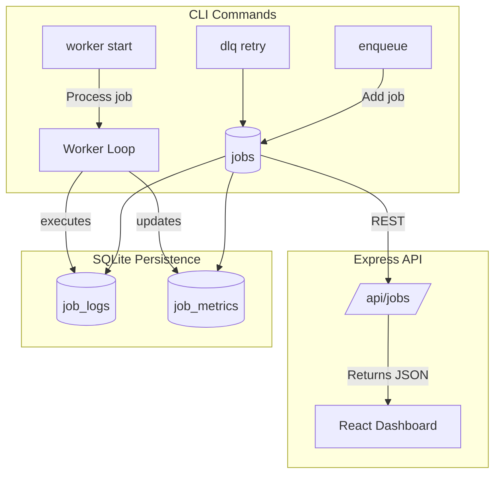
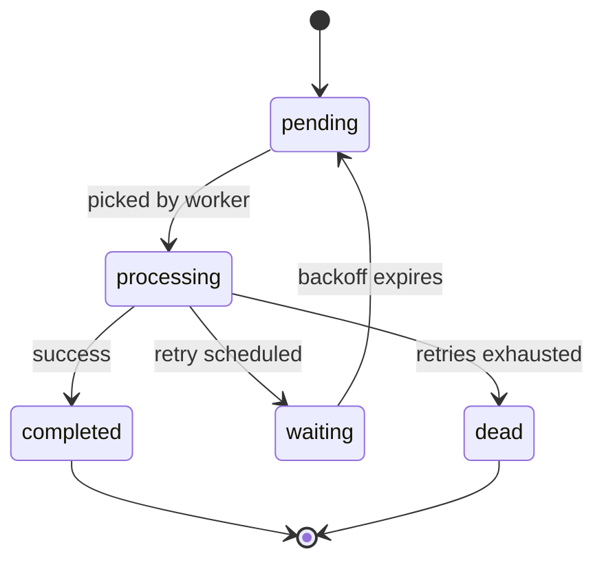

<h1 align="center">🚀 QueueCTL — Lightweight Node.js Job Queue System</h1>

<p align="center">
  
  
  
</p>

<p align="center">
  
</p>

<p align="center">
  
</p>


<!-- <p align="center">
  
</p> -->

---

## ⚙️ **Setup & Installation**

### 🧩 Clone the repository
```bash
git clone https://github.com/Nehilsa2/QueueCTL.git
cd queuectl
```
### Run test_script.sh file in bash
Test script will run and a worker.log file will be created at root to store worker logs
```bash
chmod +x test_script.sh
./test_script.sh
```

### OR read below to manually do it!

### 📦 Install dependencies
```bash
npm install
```
### 🧠 Use the CLI globally
```bash
npm i -g .
queuectl --help
```

### ▶️ Start the backend server
```bash
cd Backend
npm install
node app.js
```

### 💻 Start the frontend dashboard
```bash
cd Frontend
npm install
npm run dev
```

---

## 💡 **Usage Examples**
---
## Now open other terminal
---
### ✅ Enqueue a job  (Run all Enqueue command inside the bash)

enqueue job with id : Job1  
```bash
queuectl enqueue '{"id":"job1","command":"echo Hello Queue"}'
```
### Examples
## 📦 Job Enqueue Examples

### 🧩 Basic Command
```bash
node src/cli.js enqueue '{"command":"echo Hello QueueCTL!"}'
```
🔁 With Custom Retries
```bash

node src/cli.js enqueue '{"command":"ping -n 5 127.0.0.1", "max_retries":5}'
```
⚙️ With Priority
```bash

node src/cli.js enqueue '{"command":"echo Urgent job", "priority":1}'
```
⏰ With Scheduled Execution
```bash

node src/cli.js enqueue '{"command":"echo Scheduled job", "run_at":"2025-11-09T18:00:00"}'
```
⏳ With Custom Timeout
```bash

node src/cli.js enqueue '{"command":"ping -n 10 127.0.0.1", "timeout":5}'
```
🧠 With All Attributes
```bash

node src/cli.js enqueue '{
  "command": "ping -n 10 127.0.0.1",
  "max_retries": 4,
  "priority": 10,
  "run_at": "2025-11-09T18:00:00",
  "next_run_at": "2025-11-09T18:05:00",
  "timeout": 5
}'
```
💀 Failing Job (DLQ Test)
```bash

node src/cli.js enqueue '{"command":"false"}'
```
🕒 Timeout Test (Windows)
```bash

node src/cli.js enqueue '{"command":"ping -n 20 127.0.0.1"}'

```

### 🧵 Start workers in different terminal
```bash
queuectl worker start -count 3
```

### 📋 List jobs
```bash
queuectl list
```

### 🪦 Manage Dead Letter Queue
```bash
queuectl dlq list
queuectl dlq retry
queuectl dlq clear
```

### ⚙️ Configure queue behavior
```bash
queuectl config set max_retries 5
queuectl config set backoff_base 3
queuectl config set job_timeout 10
queuectl config get job_timeout
queuectl config get max_retries
queuectl config get backoff_base
```

---

## 🧱 **Architecture Overview**



---

## ⚙️ **Job Lifecycle**



---

## 🧩 **Core Components**

| File | Description |
|------|--------------|
| `db.js` | SQLite3 schema and migrations |
| `queue.js` | Handles enqueue, DLQ, retries, waiting state |
| `worker.js` | Worker lifecycle, metrics, retries |
| `cli.js` | CLI management tool |
| `config.js` | Persistent runtime configs |
| `dashboard/` | React + Tailwind + Framer Motion dashboard |

---

## 🧠 **Architecture Highlights**

- 💾 SQLite-backed persistence  
- 🔁 Retry mechanism with exponential backoff  
- 🪦 Dead Letter Queue for failed jobs  
- 🧠 Automatic job reactivation  
- 🧰 Persistent logs and metrics  
- 🎨 Dashboard with animations and live refresh  

---

## 📊 **Dashboard Features**

- Realtime job monitoring  
- Scrollable job table (sticky header)  
- Hover effects & animations  
- Auto-refresh toggle + manual refresh  
- State icons:  
  ⏳ *Pending* | 🔄 *Processing* | ⏸ *Waiting* | ⚠️ *Failed* | 💀 *Dead* | ✅ *Completed*  

---


### 3️⃣ Verify dashboard
Visit **http://localhost:5173**

✅ Observe live transitions → Pending → Processing → Completed  
🌀 Processing state spins  
💀 Dead + ⏸ Waiting appear dynamically  

### 4️⃣ Test DLQ behavior
```bash
queuectl enqueue '{"command":"false"}'
queuectl dlq list
queuectl dlq retry
```

---

## ⚖️ **Assumptions & Design Choices**

| Category | Choice | Reason |
|-----------|---------|--------|
| DB | SQLite3 | Lightweight and persistent |
| Retries | Exponential | Prevents quick re-fail loops |
| DLQ | Dedicated `dead` state | Safe manual recovery |
| Config | Stored in DB | CLI controlled |
| Workers | In-process | Simpler lifecycle |
| Dashboard | Poll-based | Stable real-time UX |

---

## 🧰 **Developer Commands**

| Command | Description |
|----------|-------------|
| `queuectl enqueue <json>` | Add a new job |
| `queuectl list` | List all jobs |
| `queuectl worker start -count N` | Start N workers |
| `queuectl dlq list` | List DLQ jobs |
| `queuectl dlq retry` | Retry DLQ jobs |
| `queuectl logs <Jobid>` | View logs for a job |
| `queuectl metrics` | Show job metrics |
| `queuectl config set key value` | Change runtime config |

---

## 🧩 **Test Samples**

| Type | Command | Expected Result |
|------|----------|-----------------|
| Success | `queuectl enqueue '{"command":"echo Hello"}'` | ✅ Completed |
| Retry | `queuectl enqueue '{"command":"false"}'` | 🔁 Retries → Dead |
| Long Job | `queuectl enqueue '{"command":"sleep 5 && echo Done"}'` | 🕐 Processing |
| Scheduled | `queuectl enqueue '{"command":"echo Future","run_at":"2025-11-09T18:00:00"}'` | ⏰ Scheduled |

---

## 📈 **Performance Metrics**

| Metric | Description |
|---------|-------------|
| `total_jobs` | Unique job count |
| `completed` | Finished successfully |
| `failed` | Failed attempts |
| `waiting` | Waiting for retry |
| `dead` | Permanently failed |
| `avg_duration` | Avg job duration |

---

## 🖥️ **Dashboard Preview**


---

## 🧡 **Built With**

- ⚙️ Node.js + Express  
- 💾 SQLite3  
- 🧠 CLI (yargs + chalk + cli-table3)  
- 🎨 React + TailwindCSS + Framer Motion  

